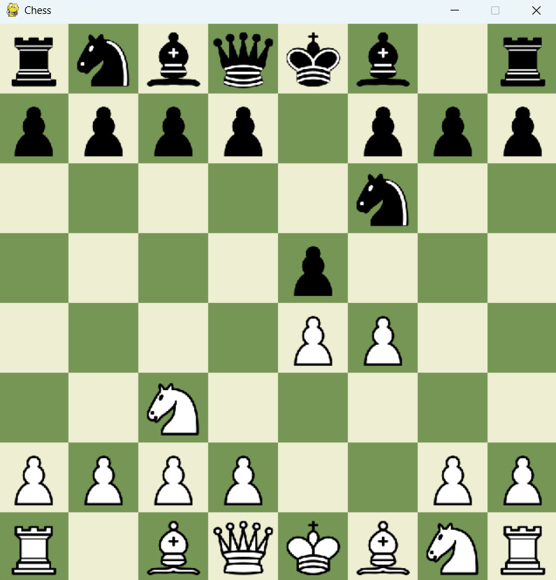

## Шахматы на Python (v.1)

Шахматы на Python на основе ООП с использованием библиотеки Pygame. 

### Для запуска   
Склонируйте репозиторий в свою рабочую директорию командой:  
`git clone https://github.com/artursul95/chess`    
Установите зависимости командой:  
`pip install -r requirements.txt`    
И запустите исполняемый файл main.py:   
`python main.py`

### Пример интерфейса  

